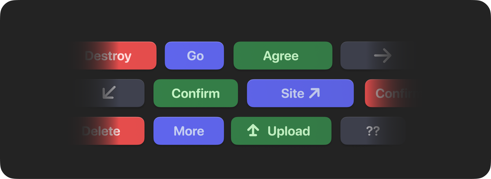

**Buttons** are clickable elements you can append to a message. In DDBKit, you put them
inside an ActionRow inside a components disclosure. Buttons have 4 styles. Each button
has a unique ID which is to identify which was clicked by the user.

```swift
Message {
	MessageContent {
		Text("Are you sure?")
	}
	MessageComponents {
		ActionRow {
			Button("Yes")
				.id("yes")
				.style(.danger)
			Button("No")
				.id("no")
				.style(.primary)
		}
	}
}
```

## Responding to user input
Similarly to other components, you simply react to clicks of a button in a
component closure of a command. You can do whatever you'd like here, whether
that be editing the original response, or following up with another message.

```swift
.component(on: "yes") { interaction in
	try? await interaction.followup {
		Message {
			Text("Confirmed")
		}
	}
}
```