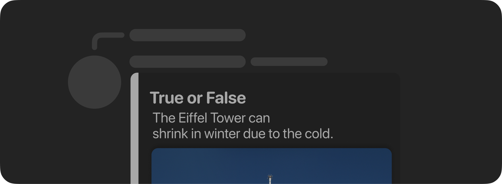

**Embeds** are containers for when you need to present information in an organized manner. They can have fields²,
a footer¹, an author¹, a title¹, an accent colour, and a description.

* ¹ doesn't support markdown
* ² supports markdown in lower text only

```swift
Message {
	MessageEmbed {
		Title("True or False")
		Description("The Eiffel Tower can shrink in winter due to the cold.")
		Image(.exact("https://upload.wikimedia.org/wikipedia/commons/8/85/Tour_Eiffel_Wikimedia_Commons_%28cropped%29.jpg"))
	}.setColor(.gray)
}
```