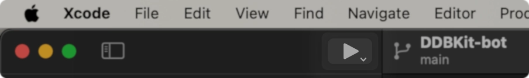

import { Aside, LinkButton, Tabs, TabItem, Code, FileTree } from '@astrojs/starlight/components';

<Aside type="note">
You can invite your bot, change your token, and manage intents at
the [Discord developer portal](https://discord.com/developers/applications).

Make sure you have acquired your token, and changed
it in `Bot.swift` or wherever you store your token securely.
</Aside>

Instructions are available per platform.

<Tabs>
  <TabItem label="macOS" icon="apple">
    ### With Xcode (recommended)
    Ensure the scheme is set to your bot, and press the run button. It will build for debugging unless you change the scheme settings.
    

    ### With a terminal
    Open a terminal, `cd` to your bot project directory,
    and paste the following command.
    <Code class="dir-my-new-bot" lang="sh" code="swift run" />
  </TabItem>
  <TabItem label="Linux and Windows" icon="linux">
    Open a terminal, `cd` to your bot project directory,
    and paste the following command.
    <Code class="dir-my-new-bot" lang="sh" code="swift run" />
  </TabItem>
  <TabItem label="Special" icon="star">
    If you have no other choice, you can run your bot on an iDevice.
    It's not recommended, but it's possible. DDBKit does not regularly
    test on iDevices, so you may run into issues. If you do, please
    report them in a [GitHub issue](https://github.com/DDBKit/DDBKit/issues).
    <Tabs>
      <TabItem label="Non-Jailbroken" icon="apple">
        ### DiscordBotShell
        You will need to migrate your codebase to work on iOS, and
        make a new project forked from the template shell app.
        You can find the shell app at [DiscordBotShell](https://github.com/DDBKit/DiscordBotShell).

        Begin by navigating to the repository, then click on `Use this template`.
        Give your repository a name, and clone it to your local machine.

        Your project structure should look like this:
        <FileTree>
        - DiscordBotShell.xcodeproj
        - DiscordBotShell
          - Shell
            - ...
          - Bot
            - BotMain.swift
          - DiscordBotShell.entitlements
          - Info.plist
        - DiscordBotShellTests
          - DiscordBotShellTests.swift
        </FileTree>

        Next, copy your bot code from your `Sources` folder to the `Bot` folder.
        > You can remove `BotMain.swift` if your bot's entrypoint is in a different file.

        > If your bot has any SPM dependencies, add them to the app now.
        > Do this by right-clicking in the empty space of the file navigator, then selecting `Add package dependencies`

        Go to your bot's entrypoint struct, remove the `@main` attribute. DiscordBotShell will handle the entrypoint.
        Rename the struct to `MyDiscordBot`, since that's what the shell app is looking for at launch.

        <Aside type="note">

        </Aside>

        Finally, build and run your bot on your iDevice.
      </TabItem>

      <TabItem label="Jailbroken" icon="seti:lock">
        ### Installing Swift
        Open your preferred package manager, and install Swift. You should know how to do this if you're jailbroken.

        ### Running your bot
        Open a terminal, `cd` to your bot project directory, clone if necessary, and then run as you would on other platforms.
        <Code class="dir-my-new-bot" lang="sh" code="swift run" />
      </TabItem>
    </Tabs>
  </TabItem>
</Tabs>
  

---

## Deployment

<Aside type="caution">
  **Remember to keep your token secure.** Do not share it with anyone.
  If you do, you can regenerate it at the Discord developer portal.
  Do not commit your token to a public repository accidentally.
  Avoid storing your token in your codebase, perhaps pass it in
  as an environment variable.
</Aside>

### Binary (for macOS)
We recommend this if you're hosting on a macOS server, and your bot relies
on macOS frameworks. 

Begin by building your bot for release with the following command:
<Code class="dir-my-new-bot" lang="sh" code="swift build -c release" />
The final binary will be located in a folder in the `.build/` folder.
The destination folder will be named after your host architecture.

You can then copy the binary and required resources to your server,
and run it with any required arguments or environment variables.

To ensure the bot launches on boot, you can use a launchd plist.
You can find more information on launchd plists at [Apple's developer documentation](https://developer.apple.com/library/archive/documentation/MacOSX/Conceptual/BPSystemStartup/Chapters/CreatingLaunchdJobs.html).

### Docker (recommended)
We recommend this if you're hosting on a Linux server, or if you're
hosting on a macOS server but don't deal with macOS frameworks.

TBA.

### Special
If you're hosting on an iDevice, you can use the same instructions as running on an iDevice.
There is no better way to deploy on an iDevice, as it's not recommended. You can be assured that
it's at least safe and sandboxed unless you used the jailbroken method. 
But it's not recommended for production use anyways. Maybe just useful
for flexing on your friends idk.
